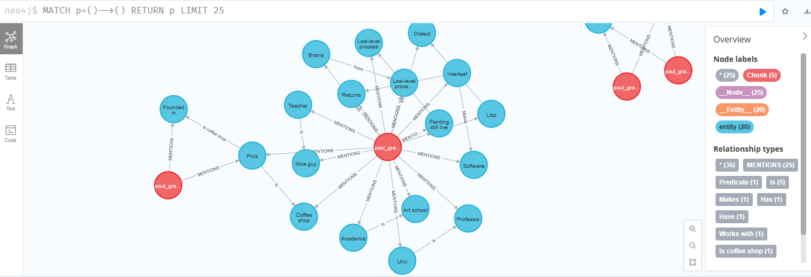

# 🚀 Neo4j Knowledge Graph with LlamaIndex, Hugging Face, and Ollama

This project demonstrates how to build a local **Knowledge Graph** using **Neo4j** as the graph database, **LlamaIndex** for document processing, **Hugging Face** embeddings, and **Ollama** as the LLM backend.  

You'll parse documents, extract structured graph information, embed text, and query knowledge efficiently.

---

## 🛠️ Setup Instructions

### 1. Install Required Python Packages
```bash
pip install llama-index
pip install llama-index-core 
pip install neo4j
pip install llama-index-graph-stores-neo4j
pip install llama_index.embeddings.huggingface
pip install einops
pip install --upgrade ipywidgets
```

> Note: `einops` is needed to avoid import errors but isn't actively used.

---

### 2. Run a Local Neo4j Instance via Docker
```bash
docker run -p 7474:7474 -p 7687:7687 \
  -v $PWD/data:/data \
  -v $PWD/plugins:/plugins \
  --name neo4j-apoc \
  -e NEO4J_apoc_export_file_enabled=true \
  -e NEO4J_apoc_import_file_enabled=true \
  -e NEO4J_apoc_import_file_use__neo4j__config=true \
  -e NEO4J_PLUGINS='["apoc"]' \
  neo4j:latest
```
This command:
- Exposes ports `7474` (browser) and `7687` (bolt protocol).
- Mounts local data and plugins directories.
- Enables **APOC** procedures.

---

## 📄 How it Works

### 1. Setup Embedding and LLM

```python
from llama_index.embeddings.huggingface import HuggingFaceEmbedding
from llama_index.llms.ollama import Ollama

embed_model = HuggingFaceEmbedding(
    model_name="nomic-ai/nomic-embed-text-v1.5",
    trust_remote_code=True,
    cache_folder='./hf_cache'
)

llm = Ollama(
    model="llama3.2:1b",
    base_url="http://localhost:11434",
    request_timeout=8000
)
```
> Note: make sure you have llama3.2:1b running with ollama
`ollama run llama3.2:1b`


---

### 2. Connect to Neo4j

```python
import os
from neo4j import GraphDatabase
from llama_index.graph_stores.neo4j import Neo4jPropertyGraphStore

NEO4J_URI = os.getenv("NEO4J_URI", "neo4j://localhost:7687")
NEO4J_USERNAME = os.getenv("NEO4J_USERNAME", "neo4j")
NEO4J_PASSWORD = os.getenv("NEO4J_PASSWORD", "tango-uncle-flag-loyal-fantasy-7396")  # Exposed for demo purposes.

# Test connection
def test_neo4j_connection():
    try:
        with GraphDatabase.driver(NEO4J_URI, auth=(NEO4J_USERNAME, NEO4J_PASSWORD)) as driver:
            with driver.session() as session:
                result = session.run("RETURN 'Neo4j is connected!'")
                print(result.single()[0])
    except Exception as e:
        print(f"Neo4j Connection Failed: {e}")

test_neo4j_connection()

# Initialize graph store
graph_store = Neo4jPropertyGraphStore(
    username=NEO4J_USERNAME,
    password=NEO4J_PASSWORD,
    url=NEO4J_URI,
)
```

---

### 3. Load Documents

```python
from llama_index.core import SimpleDirectoryReader

loader = SimpleDirectoryReader("./dataF/")
documents = loader.load_data()
```

---

### 4. Build Property Graph Index

```python
from llama_index.core import PropertyGraphIndex
from llama_index.core.indices.property_graph import SimpleLLMPathExtractor
import nest_asyncio
nest_asyncio.apply()

data_extractor = SimpleLLMPathExtractor(llm=llm)

index = PropertyGraphIndex.from_documents(
    documents,
    embed_model=embed_model,
    kg_extractors=[data_extractor],
    property_graph_store=graph_store,
    show_progress=True,
)
```

✅ **Notes**:  
- Some embedding errors (`tensor size mismatch`) may occur during document parsing but are non-blocking.
- Use `nest_asyncio` to avoid event loop issues in Jupyter or IPython.

---

### 5. Retrieve and Query

```python
from llama_index.core import Settings
from llama_index.core.indices.property_graph import LLMSynonymRetriever, VectorContextRetriever

Settings.llm = llm
Settings.embed_model = embed_model

synonym_retriever = LLMSynonymRetriever(index.property_graph_store, llm=llm, include_text=False)
vector_retriever = VectorContextRetriever(index.property_graph_store, embed_model=embed_model, include_text=False)

retriever = index.as_retriever(
    sub_retrievers=[synonym_retriever, vector_retriever]
)

context = retriever.retrieve("Who is Paul Graham?")
for triplet in context:
    print(triplet.text)
```

---

### 6. Graph-Based Question Answering

```python
query_engine = index.as_query_engine(include_text=True)
response = query_engine.query("Who is Paul Graham?")
print(response.response)
```

🧠 Example Output:
> *Paul Graham is an American entrepreneur, writer, and programmer. He co-founded Viaweb, contributed to Lisp hacking, and later founded Y Combinator.*

---

## 📈 Visual

You can visualize the graph with Neo4j browser (`http://localhost:7474`) & do graph based queries.

